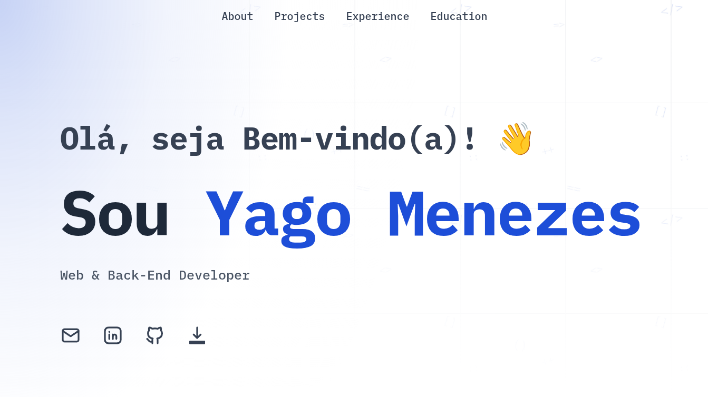

# Portfolio de Yago Menezes

  

---

## 🌐 Sobre o Portfolio

Meu portfolio pessoal é um site **100% estático**, moderno e responsivo, criado para apresentar minhas habilidades e projetos como desenvolvedor.  
O objetivo principal é mostrar meu trabalho de forma clara, interativa e otimizada, sem depender de backend.

---

## 🛠 Como Foi Construído

- **Framework:** [Astro](https://astro.build/) – utilizado para gerar HTML, CSS e JS otimizados na pasta `dist`.
- **Estilização:** Tailwind CSS para responsividade e design moderno.
- **Estrutura de Build:**  
  - `npm run build` gera a pasta `dist` com todo o conteúdo estático.  
  - Os arquivos da `dist` são copiados para o branch de deploy, que publica o site no GitHub Pages.
- **Hospedagem:** GitHub Pages serve diretamente os arquivos estáticos do branch de deploy.
- **Design:** Layout responsivo, componentes reutilizáveis e animações leves para uma experiência fluida.

---

## ⚡ Tecnologias Utilizadas

---

> 💡 Dica: Como o site é totalmente estático, todo conteúdo visível é gerado diretamente do build do Astro, garantindo performance e compatibilidade em qualquer dispositivo.
> > Este portfolio foi desenvolvido com base em um template Astro criado por [RyanFitzgerald | devportfolio](https://github.com/RyanFitzgerald/devportfolio).  
> 
 Personalizações e conteúdo são de autoria de Yago Menezes.

